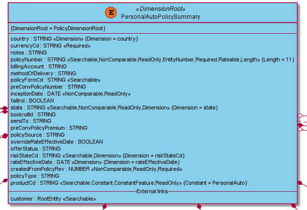
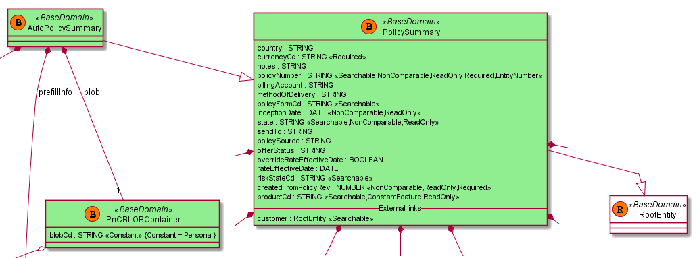
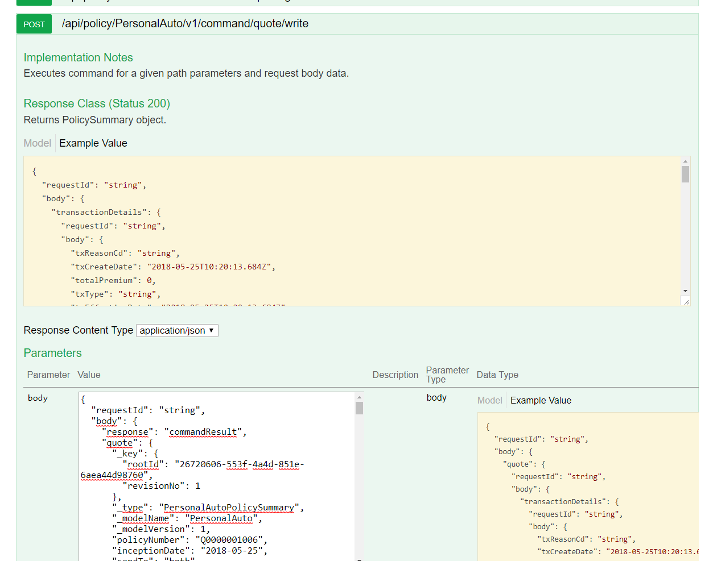

# Review folder structure and run embedded suite.

Under each folder there are different sub-systems, like policy, crm and etc. 
From /genesis-app-suite, the entire EIS Suite can be run with a mock implementation for testing purposes, rather than the full Docker:

```
mvn clean install -f pom.xml -Dapps=all -DnoReports -DnoBpm -DnoRating -Dgenesis.logs.path=/tmp
```

Command to start applications for AUTO product in embedded mode is following:

```
mvn clean install -f policy/applications/policy-app-suite/pom.xml -Dapps=policy -DnoReports -DnoBpm -DnoRating -Dgenesis.logs.path=/tmp
```

This only requires Maven 3.3.9+. Separate application logs can be found in the /tmp folder.
All the policy-related DSLs, command handlers and endpoints are in the /policy folder.
In the /policy folder, there are some policy applications that can run independently—i.e. all policy applications under 
/policy-app-suite. They can also be run separately if required, for commands under /policy/applications/auto/policy-auto-commands-app, 
etc. Note that decision tables (.json and .xlsx), lookups, jobs, security profiles, and other deployable data belong in *deployer-app modules.
Under /policy/personal-auto, there is the main code implementing the AUTO product:

* personal-auto-domain - Domain, model DSL/entities, decision tables
* personal-auto-endpoints - Facade and endpoint-related code
* personal-auto-events - Events mostly for integration and asynchronous data handling
* personal-auto-lifecycle - State machine and command handlers
* personal-auto-rules-domain - Kraken rules
* personal-auto-stubs - Some stub services, e.g. such as credit score report and others

# Connect to external database/Kafka/Zookeeper/Solr

After _Environment Setup_ guide passed, database/Kafka/Zookeeper/Solr already up and running. 
Modify the etc/hosts file on your computer by adding the following:

```
<dockerIP> kafka
<dockerIP> solr
```

After that it is possible to connect to them using appropirate tools, like Kafka Tools.

# Review the prototype domain DSL

Example DSL for the personal auto domain can be found in personal-auto-domain _PersonalAutoPolicy.gentities_.
The entity PersonalAutoPolicySummary extends the business type AutoPolicySummary and contains, for example, the attribute policyNumber:

```
Entity PersonalAutoPolicySummary is AutoPolicySummary {
    <..>
    @Rateable
    @Length(11)
    Attr policyNumber: String
    <..>
}
```



Base domain business entities are marked in green. Since this policy is extending the base (business) type AutoPolicySummary, it can be found in the Model_BaseTypes_PersonalAuto diagram.



You can see that the AutoPolicySummary business type extends the PolicySummary business type, which also contains policyNumber. Since the entity overrides it, it receives all the features (i.e. Searchable) from the base domain, and also adds rateable and length.
The PolicySummary base type only extends RootEntity.

# Call command
Start the app query policy REST /api/policy/PersonalAuto/v1/command/quote/init, which will initialize a quote, usually under port 8084). Find the policyNumber in the generated quote:

```json
{
    "requestId": "ubXiJU",
    "body": {
        "response": "commandResult",
        "success": {
            "_key": {
                "rootId": "7b37f672-d7eb-4696-b6a1-d5f47fe5b5ac",
                "revisionNo": 1
        },
        "_type": "PersonalAutoPolicySummary",
        "_modelName": "PersonalAuto",
        "_modelVersion": "1",
        "_modelType": "Policy",
        "_variation": "quote",
        "productCd": "PersonalAuto",
        "policyNumber": "P0000001001",
        <..>
    }
    <..>
}
```

To more easily query REST services, you can use visual tools like Postman or Swagger. For example, Swagger Supports online schema import at https://editor.swagger.io//#/.
You can also use the Swagger UI Console extension for Google Chrome.
Here's an example of using the Swagger UI to query the /write command:



* Swagger takes the Swagger schema, e.g. http://<dockerIP>:8084/api/common/schema/v1/PersonalAuto/swagger.json
* Postman takes Postman schema, e.g. http://<dockerIP>:8084/api/common/schema/v1/PersonalAuto/postman.json 
* A list of schemas can be found by querying http://<dockerIP>:8084/api/common/schema/v1


Try taking a generated quote from the /init endpoint and put it into a JSON request as a quote for the /write endpoint to write the quote. You may need to add an additional currencyCd attribute, for example:
```json
currencyCd": "USD"
```