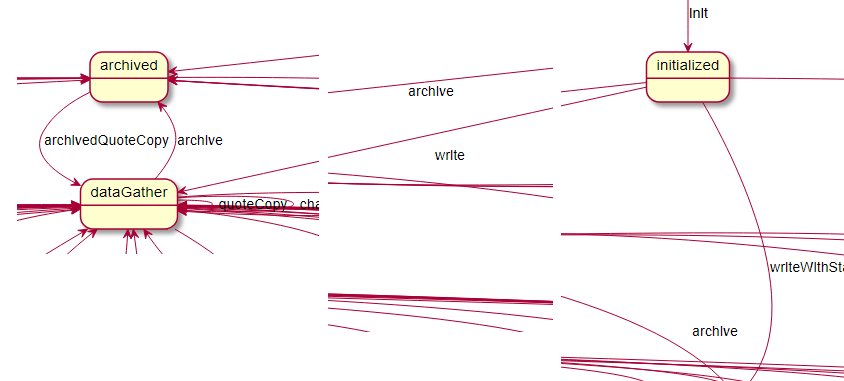

Now that you've written a quote in the previous exercise, you can use the State Machine Diagram Generator to see how the state changed from initialized to dataGather.
You can find this transition in personal-auto-lifecycle _PersonalAutoPolicy.gstates_:
```
 State initialized for quote {
 Using write command transit to dataGather
 <..>
 }
```

The State Machine Diagram Generator can be added to personal-auto-lifecycle pom.xml:

```xml
<plugin>
     <groupId>com.eisgroup.genesis.tools</groupId>
     <artifactId>fgenerator-maven-plugin</artifactId>
     <executions>
         <execution>
             <id>generate-state-uml</id>
             <phase>generate-sources</phase>
             <goals>
                 <goal>generate</goal>
             </goals>
             <configuration>
                 <inputDirectory>${project.build.directory}/classes</inputDirectory>
                 <outputDirectory>${project.build.directory}/generated-umls/</outputDirectory>
                 <generators>
                     <generator>
                         <groupId>com.eisgroup.genesis.lifecycle</groupId>
                         <artifactId>state-machine-dsl-fgenerator</artifactId>
                         <version>${lifecycle.framework.version}</version>
                     </generator>
                 </generators>
             </configuration>
         </execution> 
     </executions>
 </plugin>
```

