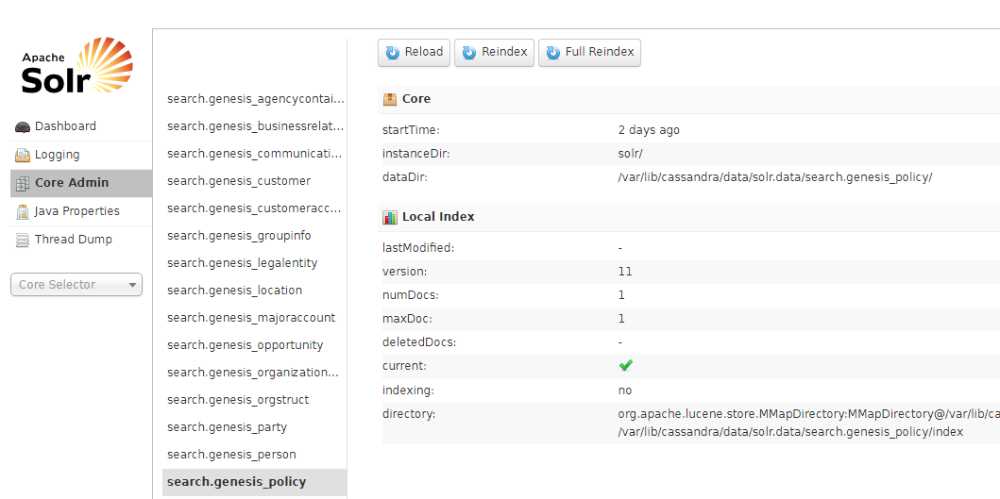
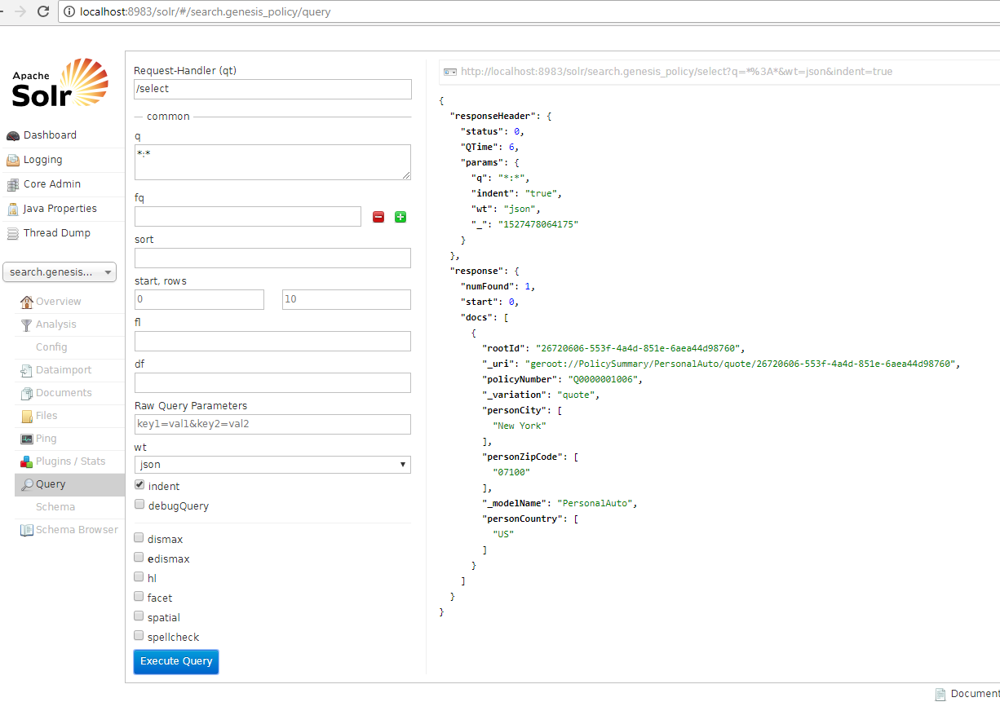

# Query search
Try querying /api/search/v1/policy/quote and searching for your written quote by policy number:

```json
{
    "body": {
        "query": {
            "policyNumber": {
                "matches": [
                    "P0000001001"
                ]
            }
        }
    }
}
```
Search service available from policy_generic_facade service, on port 8093

# Add the attribute internalPolicyNumber to PersonalAutoPolicySummary and mark it as Searchable:

```
Entity PersonalAutoPolicySummary is AutoPolicySummary {
    <..>
    @Searchable
    Attr internalPolicyNumber: String
    <..>
}
```

# Rebuild and re-run the application. Initialize /init new quote and /write that quote by adding your internalPolicyNumber to it:

Applications to rebuild/restart for Docker installation:

* policy-auto-commands-app
* policy-auto-deployer-app
* policy-auto-facade-app
* policy-generic-commands-app
* policy-generic-deployer-app
* policy-generic-events-app
* policy-generic-facade-app

**Note:** you need to manually remove **search.policy** table from cassandra before deploy, so created attribute will appear in the **search.policy** as a new column.

```json
{
    "requestId": "ubXiJU",
    "body": {
        "response": "commandResult",
        "success": {
            "_key": {
                "rootId": "7b37f672-d7eb-4696-b6a1-d5f47fe5b5ac",
                "revisionNo": 1
            },
            "_type": "PersonalAutoPolicySummary",
            "_modelName": "PersonalAuto",
            "_modelVersion": "1",
            "_modelType": "Policy",
            "_variation": "quote",
            "productCd": "PersonalAuto",
            "policyNumber": "P0000001001",
            "internalPolicyNumber": "Internal000005",
            <..>
        }
    } 
    <..>
}
```

# Now query /api/search/v1/policy/quote and search for your written quote by internal policy number:

```json
{
    "body": {
        "query": {
            "internalPolicyNumber": {
                "matches": [
                    "Internal000005"
                ]
            }
        }
    }
}
```

# Review the new searchable attribute in Solr Admin—usually under port 8983, under /solr, e.g. http://localhost:8983/solr/#/policy/query):



You can query either:
```
    q = policyNumber:P0000001001
    q = internalPolicyNumber:Internal000005
```



